# InnJoy Hotel App — Use Cases

> [!NOTE]
> Bu doküman, InnJoy otel yönetim uygulamasının tüm aktörler ve modüller bazında use case'lerini içermektedir.

## Aktörler

| Aktör | Açıklama |
|-------|----------|
| **Misafir (Guest)** | Otelde konaklayan, hizmetlerden yararlanan kullanıcı |
| **Admin** | Otel yöneticisi; oda, misafir, sipariş ve etkinlik yönetiminden sorumlu |
| **Sistem** | Otomatik bildirimler, acil durum izleme, veri senkronizasyonu |

---

## 1. Kimlik Doğrulama (Authentication)

### UC-01: Kayıt Olma (Sign Up)
| Alan | Detay |
|------|-------|
| **Aktör** | Misafir |
| **Ön Koşul** | Kullanıcı uygulamaya ilk kez giriyor |
| **Ana Akış** | 1. Kullanıcı "Sign Up" ekranını açar 2. Ad-soyad, e-posta, şifre bilgilerini girer 3. Şifre güçlülük kriterleri anlık olarak kontrol edilir 4. Sistem Firebase Auth ile hesap oluşturur 5. Kullanıcı bilgileri Firestore'a kaydedilir 6. Kullanıcı ana ekrana yönlendirilir |
| **Alternatif** | E-posta zaten kayıtlıysa hata mesajı gösterilir |

### UC-02: Giriş Yapma (Login)
| Alan | Detay |
|------|-------|
| **Aktör** | Misafir / Admin |
| **Ön Koşul** | Kayıtlı bir hesap mevcut |
| **Ana Akış** | 1. Kullanıcı e-posta ve şifre girer 2. Firebase Auth doğrulama yapar 3. Kullanıcı rolü (customer/admin) kontrol edilir 4. Role göre uygun ana ekrana yönlendirilir |
| **Alternatif** | Hatalı bilgilerde hata mesajı gösterilir |

### UC-03: Şifre Sıfırlama (Forgot Password)
| Alan | Detay |
|------|-------|
| **Aktör** | Misafir / Admin |
| **Ön Koşul** | Kayıtlı e-posta adresi mevcut |
| **Ana Akış** | 1. Kullanıcı "Forgot Password" ekranına gider 2. E-posta adresini girer 3. Sistem Firebase üzerinden şifre sıfırlama e-postası gönderir 4. Başarı mesajı gösterilir |

---

## 2. Ana Ekran (Home Dashboard)

### UC-04: Ana Dashboard'u Görüntüleme
| Alan | Detay |
|------|-------|
| **Aktör** | Misafir |
| **Ön Koşul** | Kullanıcı giriş yapmış |
| **Ana Akış** | 1. Otel bilgi kartı (otel adı, oda no, tarih aralığı) görüntülenir 2. Hizmet kısayolları (Housekeeping, Room Service vb.) listelenir 3. Yaklaşan etkinlikler kartları gösterilir 4. Harcama özeti kartı görüntülenir |

### UC-05: QR Kod ile Kapı Açma
| Alan | Detay |
|------|-------|
| **Aktör** | Misafir |
| **Ön Koşul** | Misafir aktif bir odaya atanmış |
| **Ana Akış** | 1. Misafir otel kartı üzerindeki "Unlock" butonuna basar 2. QR kod dialog penceresi açılır 3. Misafir QR kodu kapı okuyucusuna gösterir |

---

## 3. Otel Hizmetleri (Services)

### UC-06: Hizmetleri Görüntüleme ve Arama
| Alan | Detay |
|------|-------|
| **Aktör** | Misafir |
| **Ön Koşul** | Kullanıcı giriş yapmış |
| **Ana Akış** | 1. Misafir "Services" sekmesine gider 2. Kategorilere göre filtreleme yapabilir (Dining, Spa, Fitness vb.) 3. Arama çubuğu ile hizmet arayabilir 4. Hizmet kartına tıklayarak detay ekranına geçer |

### UC-07: Restoran Menüsü Görüntüleme
| Alan | Detay |
|------|-------|
| **Aktör** | Misafir |
| **Ön Koşul** | Otelde aktif restoran hizmeti mevcut |
| **Ana Akış** | 1. Misafir Dining bölümüne gider 2. Restoran menüsünü ve fiyat listesini görüntüler 3. Menü öğeleri kategori bazında listelenir |

### UC-08: Restoran Rezervasyonu Yapma
| Alan | Detay |
|------|-------|
| **Aktör** | Misafir |
| **Ön Koşul** | Restoran aktif ve müsait masa mevcut |
| **Ana Akış** | 1. Misafir "Dining Booking" ekranına gider 2. Tarih, saat ve kişi sayısı seçer 3. Rezervasyon isteği Firestore'a kaydedilir 4. Onay mesajı gösterilir |

### UC-09: Spa & Wellness Hizmetlerini Görüntüleme ve Randevu Alma
| Alan | Detay |
|------|-------|
| **Aktör** | Misafir |
| **Ön Koşul** | Otelde spa hizmeti mevcut |
| **Ana Akış** | 1. Misafir Spa & Wellness ekranına gider 2. Mevcut spa hizmetlerini inceler 3. Spa randevu formunu doldurur (tarih, saat, hizmet türü) 4. Randevu isteği sisteme kaydedilir |

### UC-10: Fitness Alanı Detaylarını Görüntüleme
| Alan | Detay |
|------|-------|
| **Aktör** | Misafir |
| **Ön Koşul** | Otelde fitness alanı mevcut |
| **Ana Akış** | 1. Misafir Fitness bölümüne gider 2. Fitness alanı detaylarını, çalışma saatlerini ve ekipman bilgilerini görüntüler |

---

## 4. Oda Servisi (Room Service)

### UC-11: Oda Servisi Menüsü Görüntüleme
| Alan | Detay |
|------|-------|
| **Aktör** | Misafir |
| **Ön Koşul** | Oda servisi hizmeti aktif |
| **Ana Akış** | 1. Misafir "Room Service" ekranına gider 2. Menü öğelerini kategorilere göre görüntüler 3. Fiyatları ve detayları inceler |

### UC-12: Oda Servisi Siparişi Verme
| Alan | Detay |
|------|-------|
| **Aktör** | Misafir |
| **Ön Koşul** | Misafir aktif bir odaya atanmış |
| **Ana Akış** | 1. Misafir menüden öğe seçer ve sepete ekler 2. Sepet ekranında siparişi gözden geçirir 3. Siparişi onaylar 4. Sipariş Firestore'a kaydedilir ve admin paneline iletilir |

---

## 5. Housekeeping (Kat Hizmeti)

### UC-13: Housekeeping Talebi Oluşturma
| Alan | Detay |
|------|-------|
| **Aktör** | Misafir |
| **Ön Koşul** | Misafir aktif bir odaya atanmış |
| **Ana Akış** | 1. Misafir "Housekeeping" ekranına gider 2. Talep türünü seçer (temizlik, havlu, vb.) 3. Ek not ekleyebilir 4. Talep sisteme kaydedilir |

---

## 6. Etkinlikler ve Aktiviteler

### UC-14: Etkinlikleri Görüntüleme
| Alan | Detay |
|------|-------|
| **Aktör** | Misafir |
| **Ön Koşul** | Otelde etkinlikler tanımlanmış |
| **Ana Akış** | 1. Misafir "Events & Activities" ekranına gider 2. Mevcut etkinlikleri tarih, kategori, saat bilgileriyle görüntüler 3. Etkinlik kartına tıklayarak detay ekranına geçer |

### UC-15: Etkinliğe Katılma
| Alan | Detay |
|------|-------|
| **Aktör** | Misafir |
| **Ön Koşul** | Etkinlik aktif ve kontenjan müsait |
| **Ana Akış** | 1. Misafir etkinlik detay ekranında "Katıl" butonuna tıklar 2. Katılım kaydı Firestore'a eklenir 3. Onay mesajı gösterilir |

### UC-16: İlgi Alanına Göre Etkinlik Bildirimi Alma
| Alan | Detay |
|------|-------|
| **Aktör** | Sistem → Misafir |
| **Ön Koşul** | Misafir ilgi alanlarını belirtmiş |
| **Ana Akış** | 1. Admin yeni bir etkinlik oluşturur 2. Sistem, etkinliğin kategorisiyle eşleşen ilgi alanlarına sahip misafirlere bildirim gönderir |

---

## 7. Acil Durum (Emergency / SOS)

### UC-17: SOS Alarmı Gönderme
| Alan | Detay |
|------|-------|
| **Aktör** | Misafir |
| **Ön Koşul** | Kullanıcı giriş yapmış |
| **Ana Akış** | 1. Misafir "Emergency" ekranına gider 2. Acil durum türünü seçer (yangın, sağlık, güvenlik vb.) 3. SOS butonuna basar 4. Konum bilgisi otomatik algılanır 5. Acil durum bildirimi anında Firestore'a kaydedilir ve admin ekranına iletilir |

### UC-18: En Yakın Acil Çıkışı Görüntüleme
| Alan | Detay |
|------|-------|
| **Aktör** | Misafir |
| **Ön Koşul** | Konum servisi aktif |
| **Ana Akış** | 1. Sistem kullanıcının konumunu tespit eder 2. En yakın acil çıkış kapısı harita üzerinde gösterilir 3. Misafir tam ekran haritayı açarak detaylı görüntüleyebilir |

### UC-19: Acil Durum Bildirimlerini Yönetme (Admin)
| Alan | Detay |
|------|-------|
| **Aktör** | Admin |
| **Ön Koşul** | SOS alarmı gönderilmiş |
| **Ana Akış** | 1. Admin acil durum yönetim ekranına gider 2. Aktif acil durum bildirimlerini listeler 3. Durum güncellemesi yapar (çözümlendi, devam ediyor vb.) |

---

## 8. Misafir Talepleri (Requests)

### UC-20: Genel Talep Oluşturma
| Alan | Detay |
|------|-------|
| **Aktör** | Misafir |
| **Ön Koşul** | Misafir aktif bir odaya atanmış |
| **Ana Akış** | 1. Misafir "My Requests" ekranına gider 2. Yeni talep oluşturur (yastık, minibar, bakım vb.) 3. Talep detaylarını ve notlarını girer 4. Talep Firestore'a kaydedilir |

### UC-21: Talepleri Takip Etme
| Alan | Detay |
|------|-------|
| **Aktör** | Misafir |
| **Ön Koşul** | Daha önce talep oluşturulmuş |
| **Ana Akış** | 1. Misafir talepler listesini açar 2. Her talebin durumunu (beklemede, işleniyor, tamamlandı) görüntüler |

---

## 9. Harcama Takibi (Spending Tracker)

### UC-22: Harcamaları Görüntüleme
| Alan | Detay |
|------|-------|
| **Aktör** | Misafir |
| **Ön Koşul** | Konaklama süresince harcama yapılmış |
| **Ana Akış** | 1. Misafir "Spending Tracker" ekranına gider 2. Toplam harcama tutarını görüntüler 3. Kategorilere göre (restoran, spa, room service vb.) harcama dağılımını inceler 4. Tarih aralığına göre filtreleme yapabilir |

### UC-23: Harcama Detaylarını İnceleme
| Alan | Detay |
|------|-------|
| **Aktör** | Misafir |
| **Ana Akış** | 1. Misafir bir kategoriye tıklar 2. O kategorideki tüm işlem detaylarını görüntüler (tarih, tutar, açıklama) 3. Grup veya liste görünümü arasında geçiş yapabilir |

### UC-24: Hesap Ödeme (Settle)
| Alan | Detay |
|------|-------|
| **Aktör** | Misafir |
| **Ana Akış** | 1. Misafir toplam borcu görüntüler 2. "Settle" butonuna tıklar 3. Ödeme onay dialogu açılır |

---

## 10. Profil Yönetimi

### UC-25: Profil Bilgilerini Görüntüleme ve Düzenleme
| Alan | Detay |
|------|-------|
| **Aktör** | Misafir |
| **Ana Akış** | 1. Misafir profil ekranına gider 2. Ad-soyad, e-posta, profil fotoğrafı bilgilerini görüntüler 3. "Edit Profile" ile bilgilerini günceller 4. Değişiklikler Firestore ve Firebase Auth'a kaydedilir |

### UC-26: Şifre Değiştirme
| Alan | Detay |
|------|-------|
| **Aktör** | Misafir |
| **Ana Akış** | 1. Misafir "Change Password" ekranına gider 2. Mevcut şifresini girer 3. Yeni şifreyi girer (güçlülük kriterleri kontrol edilir) 4. Şifre Firebase Auth üzerinden güncellenir |

### UC-27: Bildirim Tercihlerini Ayarlama
| Alan | Detay |
|------|-------|
| **Aktör** | Misafir |
| **Ana Akış** | 1. Misafir "Notifications" ayarlar ekranına gider 2. Bildirim kategorilerini (etkinlik, acil durum, sipariş vb.) açıp kapatır 3. Tercihler kaydedilir |

### UC-28: WiFi Bağlantı Bilgilerini Görüntüleme
| Alan | Detay |
|------|-------|
| **Aktör** | Misafir |
| **Ana Akış** | 1. Misafir "WiFi Connection" ekranına gider 2. Otel WiFi ağ adı ve şifresi görüntülenir |

### UC-29: Yardım ve Destek
| Alan | Detay |
|------|-------|
| **Aktör** | Misafir |
| **Ana Akış** | 1. Misafir "Help & Support" ekranına gider 2. SSS, iletişim bilgileri ve destek seçeneklerini görüntüler |

### UC-30: Çıkış Yapma (Logout)
| Alan | Detay |
|------|-------|
| **Aktör** | Misafir / Admin |
| **Ana Akış** | 1. Kullanıcı profil ekranında "Logout" butonuna tıklar 2. Firebase Auth oturumu kapatılır 3. Login ekranına yönlendirilir |

---

## 11. Admin — Oda Yönetimi

### UC-31: Odaları Listeleme ve Filtreleme
| Alan | Detay |
|------|-------|
| **Aktör** | Admin |
| **Ana Akış** | 1. Admin oda yönetim ekranına gider 2. Tüm odaları listeler 3. Durum (müsait, dolu, bakımda) ve tür bazında filtreleme yapar |

### UC-32: Oda Ekleme / Düzenleme / Silme
| Alan | Detay |
|------|-------|
| **Aktör** | Admin |
| **Ana Akış** | 1. Admin yeni oda ekler veya mevcut oda bilgilerini düzenler 2. Oda numarası, türü, kapasitesi, fiyatı gibi bilgileri girer 3. Değişiklikler Firestore'a kaydedilir |

### UC-33: Odaya Misafir Atama
| Alan | Detay |
|------|-------|
| **Aktör** | Admin |
| **Ana Akış** | 1. Admin oda detayında "Misafir Ata" seçer 2. Kayıtlı misafirler listesinden seçim yapar 3. Check-in ve check-out tarihleri belirlenir 4. Atama kaydedilir |

---

## 12. Admin — Misafir Yönetimi

### UC-34: Misafirleri Listeleme ve Yönetme
| Alan | Detay |
|------|-------|
| **Aktör** | Admin |
| **Ana Akış** | 1. Admin misafir yönetim ekranına gider 2. Otele kayıtlı tüm misafirleri listeler 3. Misafir detaylarını görüntüler ve düzenler |

---

## 13. Admin — Housekeeping Yönetimi

### UC-35: Housekeeping Taleplerini Yönetme
| Alan | Detay |
|------|-------|
| **Aktör** | Admin |
| **Ana Akış** | 1. Admin housekeeping yönetim ekranını açar 2. Gelen temizlik taleplerini oda bazında görüntüler 3. Talep durumunu günceller (beklemede → işleniyor → tamamlandı) |

---

## 14. Admin — Talep Yönetimi

### UC-36: Misafir Taleplerini Yönetme
| Alan | Detay |
|------|-------|
| **Aktör** | Admin |
| **Ana Akış** | 1. Admin talep yönetim ekranına gider 2. Tüm misafir taleplerini listeler 3. Talepleri durum, oda numarası veya öncelik bazında filtreler 4. Talep durumunu günceller |

---

## 15. Admin — Restoran Yönetimi

### UC-37: Restoran Ayarlarını Yapılandırma
| Alan | Detay |
|------|-------|
| **Aktör** | Admin |
| **Ana Akış** | 1. Admin restoran yönetim ekranına gider 2. Restoran çalışma saatleri, kapasite ve ayarlarını yapılandırır |

### UC-38: Restoran Menüsünü Yönetme
| Alan | Detay |
|------|-------|
| **Aktör** | Admin |
| **Ana Akış** | 1. Admin menü yönetim ekranına gider 2. Yeni menü öğesi ekler (ad, açıklama, fiyat, kategori, görsel) 3. Mevcut öğeleri düzenler veya siler |

### UC-39: Restoran Rezervasyonlarını Yönetme
| Alan | Detay |
|------|-------|
| **Aktör** | Admin |
| **Ana Akış** | 1. Admin rezervasyon ekranını açar 2. Gelen rezervasyonları tarih/saat bazında görüntüler 3. Rezervasyonları onaylar veya reddeder |

---

## 16. Admin — Room Service Yönetimi

### UC-40: Room Service Menüsünü Yönetme
| Alan | Detay |
|------|-------|
| **Aktör** | Admin |
| **Ana Akış** | 1. Admin room service menü yönetim ekranına gider 2. Menü öğelerini ekler, düzenler veya siler 3. Fiyat ve kategori bilgilerini günceller |

### UC-41: Room Service Siparişlerini Yönetme
| Alan | Detay |
|------|-------|
| **Aktör** | Admin |
| **Ana Akış** | 1. Admin sipariş yönetim ekranına gider 2. Gelen siparişleri oda numarasıyla birlikte görüntüler 3. Sipariş durumunu günceller (hazırlanıyor, yolda, teslim edildi) |

---

## 17. Admin — Etkinlik Yönetimi

### UC-42: Etkinlik Oluşturma ve Düzenleme
| Alan | Detay |
|------|-------|
| **Aktör** | Admin |
| **Ana Akış** | 1. Admin etkinlik yönetim ekranına gider 2. Yeni etkinlik oluşturur (başlık, açıklama, tarih, saat, konum, kategori, görsel) 3. Mevcut etkinlikleri düzenler veya siler 4. Etkinlik yayınlandığında ilgili misafirlere bildirim gönderilir |

### UC-43: Etkinlik Katılımcılarını Görüntüleme
| Alan | Detay |
|------|-------|
| **Aktör** | Admin |
| **Ana Akış** | 1. Admin etkinlik detayında katılımcı listesini görüntüler 2. Katılımcı sayısını ve bilgilerini inceler |

---

## 18. Admin — Spa Yönetimi

### UC-44: Spa Hizmetlerini ve Randevularını Yönetme
| Alan | Detay |
|------|-------|
| **Aktör** | Admin |
| **Ana Akış** | 1. Admin spa yönetim ekranına gider 2. Spa hizmetlerini (türler, fiyatlar, süreler) yapılandırır 3. Gelen randevuları inceler ve yönetir |

---

## 19. Bildirim Sistemi

### UC-45: Acil Durum Bildirimi Alma
| Alan | Detay |
|------|-------|
| **Aktör** | Sistem → Admin |
| **Ana Akış** | 1. Misafir SOS alarmı gönderir 2. Sistem Firestore'daki değişikliği dinler 3. Admin'e sesli bildirim ve push notification gönderilir 4. Bildirim misafirin konumu, oda numarası ve acil durum türünü içerir |

### UC-46: Etkinlik Bildirimi Alma
| Alan | Detay |
|------|-------|
| **Aktör** | Sistem → Misafir |
| **Ana Akış** | 1. İlgi alanlarıyla eşleşen yeni etkinlik oluşturulur 2. Sistem push notification gönderir 3. Bildirime tıklanarak etkinlik detayına gidilir |

---

## Planları Görüntüleme

### UC-47: Aktif Planları Görüntüleme (My Plans)
| Alan | Detay |
|------|-------|
| **Aktör** | Misafir |
| **Ana Akış** | 1. Misafir "My Plans" ekranına gider 2. Aktif spa randevuları, restoran rezervasyonları, etkinlik katılımları listelenir 3. Plan detaylarını görüntüler |

---

## Use Case Diyagramı (Özet)

```mermaid
graph TB
    subgraph Misafir["🏨 Misafir (Guest)"]
        UC01["Kayıt Ol"]
        UC02["Giriş Yap"]
        UC03["Şifre Sıfırla"]
        UC04["Dashboard Görüntüle"]
        UC05["QR ile Kapı Aç"]
        UC06["Hizmetleri Ara"]
        UC08["Restoran Rezervasyonu"]
        UC09["Spa Randevusu"]
        UC11["Room Service Sipariş"]
        UC13["Housekeeping Talebi"]
        UC14["Etkinlikleri Gör"]
        UC15["Etkinliğe Katıl"]
        UC17["SOS Gönder"]
        UC18["Acil Çıkışı Gör"]
        UC20["Talep Oluştur"]
        UC22["Harcama Takibi"]
        UC25["Profil Düzenle"]
        UC47["Planlarımı Gör"]
    end

    subgraph Admin["⚙️ Admin"]
        UC31["Oda Yönetimi"]
        UC34["Misafir Yönetimi"]
        UC35["Housekeeping Yönetimi"]
        UC36["Talep Yönetimi"]
        UC38["Menü Yönetimi"]
        UC39["Rezervasyon Yönetimi"]
        UC41["Sipariş Yönetimi"]
        UC42["Etkinlik Yönetimi"]
        UC44["Spa Yönetimi"]
        UC19["Acil Durum Yönetimi"]
    end

    subgraph Sistem["🤖 Sistem"]
        UC45["Acil Durum Bildirimi"]
        UC46["Etkinlik Bildirimi"]
    end

    UC17 --> UC45
    UC42 --> UC46
```

