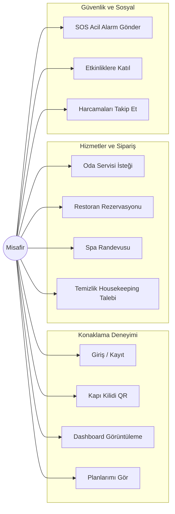
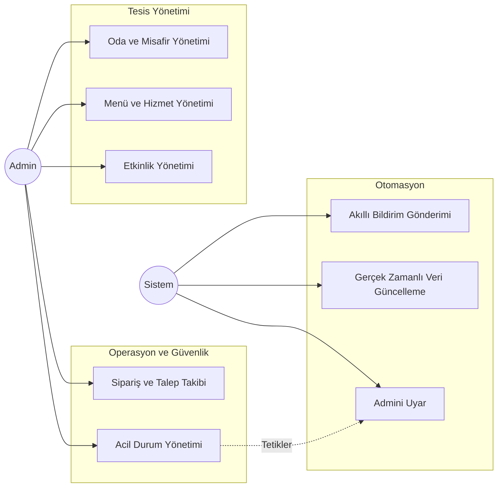

# 🏨 InnJoy Hotel App — Kapsamlı Use Case (Kullanım Durumu) Dokümanı

> [!NOTE]
> Bu doküman, InnJoy otel yönetim ve misafir deneyimi uygulamasının tüm aktörlerini, sistem bileşenlerini ve kullanım senaryolarını detaylandırmaktadır. Proje geliştirme ve test süreçlerinde referans alınması amacıyla hazırlanmıştır.

## 📋 İçindekiler
1. [Aktörler](#aktörler)
2. [Misafir (Guest) Kullanım Durumları](#misafir-guest-kullanım-durumları)
   - [Kimlik Doğrulama](#1-kimlik-doğrulama-authentication)
   - [Ana Ekran ve Erişim](#2-ana-ekran-ve-erişim)
   - [Otel Hizmetleri](#3-otel-hizmetleri)
   - [Oda Servisi ve Housekeeping](#4-oda-servisi-ve-housekeeping)
   - [Etkinlikler ve Sosyal Alanlar](#5-etkinlikler-ve-sosyal-alanlar)
   - [Acil Durum Yönetimi](#6-acil-durum-emergency)
   - [Harcama ve Profil Yönetimi](#7-harcama-ve-profil-yönetimi)
3. [Yönetici (Admin) Kullanım Durumları](#yönetici-admin-kullanım-durumları)
   - [Tesis ve Oda Yönetimi](#8-tesis-ve-oda-yönetimi)
   - [Hizmet ve Sipariş Yönetimi](#9-hizmet-ve-sipariş-yönetimi)
4. [Sistem Süreçleri](#sistem-süreçleri)
5. [Use Case Diyagramları](#use-case-diyagramları)

---

## 👥 Aktörler

| Aktör | Rol ve Sorumluluklar |
|-------|----------------------|
| **Misafir (Guest)** | Otelde konaklayan, mobil uygulama üzerinden tüm hizmetlere erişen, sipariş veren ve etkinliklere katılan temel kullanıcı. |
| **Admin (Yönetici)** | Otelin operasyonel süreçlerini yöneten, odaları, misafirleri, siparişleri, etkinlikleri ve acil durumları takip eden personel/yönetici. |
| **Sistem** | Arka planda çalışan, otomatik bildirimler gönderen, Firebase entegrasyonlarını sağlayan ve acil durum alarmlarını yönlendiren otonom yapı. |

---

## 🧳 Misafir (Guest) Kullanım Durumları

### 1. Kimlik Doğrulama (Authentication)

#### 🔑 UC-01: Sisteme Kayıt Olma (Sign Up)
* **Aktör:** Misafir
* **Ön Koşul:** Kullanıcının uygulamada henüz bir hesabı bulunmamalıdır.
* **Ana Akış:**
  1. Kullanıcı "Kayıt Ol" (Sign Up) ekranını açar.
  2. Ad-soyad, e-posta ve şifre bilgilerini girer.
  3. Sistem, şifre güçlülük kriterlerini eşzamanlı olarak denetler.
  4. Firebase Auth aracılığıyla yeni bir kullanıcı hesabı oluşturulur.
  5. Kullanıcının temel bilgileri Firestore veritabanına kaydedilir.
  6. Başarılı kayıt sonrası kullanıcı ana ekrana (Dashboard) yönlendirilir.
* **Alternatif Akış:** E-posta adresi sistemde zaten kayıtlıysa, kullanıcıya "Bu e-posta adresi zaten kullanımda" uyarısı verilir ve giriş ekranına yönlendirilir.

#### 🔐 UC-02: Giriş Yapma (Login)
* **Aktör:** Misafir / Admin
* **Ön Koşul:** Kullanıcının sistemde kayıtlı bir hesabı olmalıdır.
* **Ana Akış:**
  1. Kullanıcı e-posta ve şifresini girer.
  2. Firebase Auth üzerinden kimlik doğrulaması yapılır.
  3. Firestore üzerinden kullanıcının rolü (Misafir veya Admin) kontrol edilir.
  4. Role uygun olan özel ana ekrana (Misafir Dashboard veya Admin Panel) yönlendirilir.
* **Alternatif Akış:** Hatalı e-posta veya şifre girişinde "Kullanıcı adı veya şifre hatalı" uyarısı gösterilir.

#### 🔄 UC-03: Şifre Sıfırlama (Forgot Password)
* **Aktör:** Misafir / Admin
* **Ön Koşul:** Kullanıcının kayıtlı bir e-posta adresi olmalıdır.
* **Ana Akış:**
  1. Kullanıcı şifremi unuttum ekranına erişir.
  2. Kayıtlı e-posta adresini girer.
  3. Sistem, Firebase üzerinden güvenli bir şifre sıfırlama bağlantısı gönderir.
  4. Kullanıcıya "Şifre sıfırlama bağlantısı e-posta adresinize gönderildi" mesajı gösterilir.

### 2. Ana Ekran ve Erişim

#### 📱 UC-04: Ana Dashboard'u Görüntüleme
* **Aktör:** Misafir
* **Ön Koşul:** Kullanıcı sisteme başarıyla giriş yapmış olmalıdır.
* **Ana Akış:**
  1. Otel bilgileri ve konaklama detayları (oda no, tarih aralığı) en üstte gösterilir.
  2. Sık kullanılan hizmetler (Oda Servisi, Temizlik, Spa vb.) hızlı erişim butonları olarak listelenir.
  3. Yaklaşan otel etkinlikleri dinamik bir kart yapısıyla (carousel) sunulur.
  4. Kullanıcının güncel harcama özeti mini bir kart olarak gösterilir.

#### 🚪 UC-05: Dijital Anahtar (QR Kod) ile Kapı Açma
* **Aktör:** Misafir
* **Ön Koşul:** Misafirin otelde aktif ve onaylanmış bir oda kaydı bulunmalıdır.
* **Ana Akış:**
  1. Misafir, ana ekrandaki dijital otel kartı üzerindeki "Unlock" (Kilidi Aç) butonuna tıklar.
  2. Ekranda yüksek parlaklıkta ve güvenli bir QR kod (veya NFC animasyonu) belirir.
  3. Misafir cihazını oda kapısındaki akıllı okuyucuya yaklaştırır/okutur ve kapı açılır.

### 3. Otel Hizmetleri

#### 🔍 UC-06: Hizmet Kataloğunu İnceleme
* **Aktör:** Misafir
* **Ön Koşul:** Sisteme giriş yapılmış olmalıdır.
* **Ana Akış:**
  1. Misafir "Services" menüsüne tıklar.
  2. Restoran, Spa, Fitness, Transfer gibi tüm tesis hizmetlerini kategoriler halinde görüntüler.
  3. İlgilendiği hizmet kategorisine tıklayarak detay (açıklama, saatler, kurallar) sayfasına erişir.

#### 🍽️ UC-07: Restoran Rezervasyonu Yapma
* **Aktör:** Misafir
* **Ön Koşul:** Otelde ilgili saatte aktif restoran hizmeti bulunmalı ve masalar müsait olmalıdır.
* **Ana Akış:**
  1. Misafir Restoran/Dining ekranından dijital menüyü inceler.
  2. "Rezervasyon Yap" butonuna tıklar; kişi sayısı, tarih ve saat seçimi yapar.
  3. Özel isteklerini (Alerji durumu, cam kenarı vb.) not olarak ekler.
  4. Talep Firestore'a işlenir ve kullanıcıya anında "Rezervasyonunuz Alındı" onayı gösterilir.

#### 💆 UC-08: Spa & Wellness Randevusu Alma
* **Aktör:** Misafir
* **Ön Koşul:** Spa merkezi açık ve seçilen saat diliminde terapist müsait olmalıdır.
* **Ana Akış:**
  1. Misafir Spa detay sayfasından masaj/bakım paketlerini inceler.
  2. İstediği hizmeti seçerek tarih ve saat belirler.
  3. Randevu alınır ve misafirin "Aktif Planlarım" listesine eklenir.

### 4. Oda Servisi ve Housekeeping

#### 🛎️ UC-09: Oda Servisi (Room Service) Siparişi Verme
* **Aktör:** Misafir
* **Ön Koşul:** Misafirin check-in işlemi yapılmış, aktif bir odası olmalıdır.
* **Ana Akış:**
  1. "Room Service" dijital menüsüne girilir. Kategorilere (Yemek, İçecek, Tatlı) göre ürünler incelenir.
  2. Ürünler sepete eklenir ve sepet onayı ekranına geçilir.
  3. "Siparişi Tamamla" butonuna basıldığında sipariş Admin/Mutfak ekranına anında düşer. Yemek bedeli kullanıcının oda hesabına yazılır.

#### 🧹 UC-10: Housekeeping (Temizlik/Malzeme) Talebi
* **Aktör:** Misafir
* **Ön Koşul:** Misafir odasında konaklamaya devam ediyor olmalıdır.
* **Ana Akış:**
  1. "Housekeeping" menüsüne girilir.
  2. Temizlik, ekstra havlu, bebek yatağı, minibar yenileme gibi hazır seçeneklerden biri seçilir veya özel bir not yazılır.
  3. Gönderilen talep Admin paneline ve kat görevlilerinin ekranına "Bekliyor" statüsünde düşer.

### 5. Etkinlikler ve Sosyal Alanlar

#### 📅 UC-11: Etkinlikleri Görüntüleme ve Katılma
* **Aktör:** Misafir
* **Ön Koşul:** Otel yönetimi tarafından sisteme eklenmiş aktif etkinlikler olmalıdır.
* **Ana Akış:**
  1. "Events & Activities" (Etkinlikler) sekmesi açılır.
  2. Konser, Yoga Dersi, Şehir Turu gibi etkinlikler tarih ve saat sırasıyla listelenir.
  3. Misafir ilgilendiği etkinliğin detayına girip "Katıl" (Join) butonuna basar.
  4. Etkinlik misafirin kişisel takvimine/planlarına eklenir.

#### 🎯 UC-12: İlgi Alanına Göre Akıllı Bildirim
* **Aktör:** Sistem
* **Ön Koşul:** Misafir kayıt olurken veya profilinden ilgi alanlarını (Spor, Müzik, Sanat vb.) seçmiş olmalıdır.
* **Ana Akış:**
  1. Admin sisteme yeni bir etkinlik girdiğinde, sistem etkinliğin etiketlerini inceler.
  2. Bu etiketlerle eşleşen misafirlere özel ve kişiselleştirilmiş bir push (anlık) bildirim gönderilir.

### 6. Acil Durum (Emergency)

#### 🚨 UC-13: SOS Acil Durum Alarmı Gönderme
* **Aktör:** Misafir
* **Ön Koşul:** Otel sınırları içerisinde veya odada bulunmalıdır.
* **Ana Akış:**
  1. Acil bir durumda misafir uygulamadaki kırmızı "Emergency" veya "SOS" butonuna basar.
  2. Ekranda çıkan (Sağlık, Yangın, Güvenlik) seçeneklerinden birine tıklar.
  3. Uygulama, kullanıcının GPS konumunu veya kayıtlı oda numarasını alarak saniyeler içinde Admin ve Güvenlik ekranlarına en yüksek öncelikli sesli alarm olarak iletir.

#### 🏃 UC-14: En Yakın Acil Çıkış Rotası
* **Aktör:** Misafir
* **Ön Koşul:** Kullanıcının konum servisleri açık olmalıdır.
* **Ana Akış:**
  1. Acil durum anında veya menüden seçildiğinde otelin kat planı açılır.
  2. Sistemin algıladığı konuma göre en yakın acil çıkış kapısı veya toplanma alanı haritaya çizilir.

### 7. Harcama ve Profil Yönetimi

#### 💳 UC-15: Harcama Takibi (Spending Tracker)
* **Aktör:** Misafir
* **Ön Koşul:** Kullanıcının otelde gerçekleştirdiği ücretli işlemler olmalıdır.
* **Ana Akış:**
  1. Misafir "Harcamalarım" (Spending Tracker) sayfasına gider.
  2. Uygulama, Restoran, Spa ve Oda Servisi harcamalarını kategorik pasta grafik (pie chart) üzerinde gösterir.
  3. Tüm harcamalar kronolojik bir ekstre olarak listelenir.
  4. İstenirse "Hesabı Kapat / Öde" (Settle) aksiyonu ile resepsiyona ödeme talebi iletilebilir.

#### ⚙️ UC-16: Profil ve Tercih Yönetimi
* **Aktör:** Misafir
* **Ana Akış:**
  1. Profil menüsünden kişisel bilgiler güncellenir.
  2. Bildirim ayarları (Sadece önemli bildirimleri al vb.) düzenlenir.
  3. Aktif planlar (My Plans) sekmesinden yaklaşan tüm rezervasyonlar tek bir zaman çizelgesinde (timeline) görüntülenir.

---

## 🛠️ Yönetici (Admin) Kullanım Durumları

### 8. Tesis ve Oda Yönetimi

#### 🏨 UC-17: Odaları ve Durumlarını Görüntüleme
* **Aktör:** Admin
* **Ana Akış:** Admin panelindeki Oda Yönetimi sayfasından oteldeki tüm odalar; "Dolu", "Boş", "Temizlik Bekliyor", "Bakımda" gibi statülere göre renk kodlu olarak görüntülenir.

#### 👥 UC-18: Misafir Atama ve Yönetim (Check-in/Out)
* **Aktör:** Admin
* **Ana Akış:**
  1. Yeni gelen bir misafire oda atanır, check-in ve tahmini check-out tarihleri belirlenir.
  2. Misafirin sistemdeki hesabı ile fiziki oda eşleştirilir, böylece misafir uygulamasındaki mobil anahtar ve sipariş modülleri aktifleşir.

### 9. Hizmet ve Sipariş Yönetimi

#### 📋 UC-19: Merkezi Talep ve Sipariş Takibi
* **Aktör:** Admin
* **Ana Akış:**
  1. Misafirlerden gelen Housekeeping talepleri, Oda Servisi siparişleri ve Özel İstekler tek bir merkezi panodan canlı (real-time) olarak akar.
  2. Admin, gelen siparişi "Hazırlanıyor", "Yolda", "Tamamlandı" statülerine çeker. Durum değişikliği anında misafirin uygulamasına bildirim olarak yansır.

#### 🎉 UC-20: Etkinlik ve Menü Yönetimi
* **Aktör:** Admin
* **Ana Akış:** Restoran menülerine yeni yemekler eklenir, stokta bitenler pasife alınır. Yeni otel içi etkinlikler (Yoga, Konser vb.) oluşturulup görsel ve detaylarıyla yayına alınır.

---

## 🤖 Sistem Süreçleri

#### ⚡ UC-21: Otomatik Veri Senkronizasyonu ve Bildirim Yönlendirme
* **Aktör:** Sistem
* **Ana Akış:**
  1. Bir sipariş verildiğinde veya SOS alarmı üretildiğinde Firebase Cloud Functions tetiklenir.
  2. Alarm durumlarında Admin panelleri zorunlu olarak sesli uyarı çalarak uyanır.
  3. Veritabanındaki değişiklikler anında Admin Web arayüzüne ve Misafir Mobil uygulamasına (WebSocket/Gerçek zamanlı abonelik) yansıtılır.

---

## 🎨 Use Case Diyagramları

Aşağıdaki diyagramlar sistemdeki aktörlerin modüller ile olan ilişkilerini görselleştirmektedir.

### 🟢 Misafir (Guest) Kullanım Senaryoları

### 🔴 Yönetici (Admin) ve Sistem Etkileşimi

